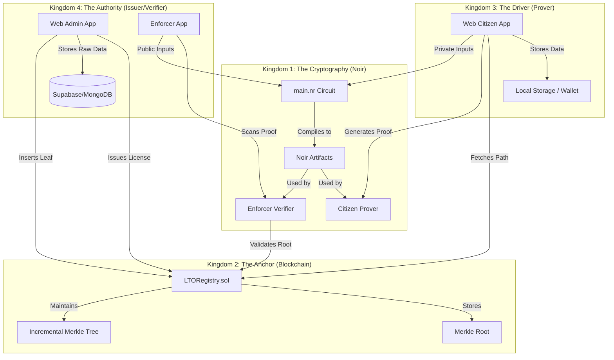

# Hybrid-Transparency Project Relations Graph

This document maps the relationships, data flows, and architectural components of the **Hybrid-Transparency** system.

## 🕸️ High-Level System Architecture

---

## 🏗️ Core Components

### 1. [[Kingdom_1_Cryptography|Kingdom 1: The Cryptography]]
- **File**: `circuits/src/main.nr`
- **Logic**:
    - **Leaf Reconstruction**: `hash(secret, private_license_data, public_name)`
    - **Merkle Proof**: Validates inclusion against `public_merkle_root`.
    - **Nullifier Generation**: `hash(secret, scope)` to prevent linkability across different "scopes" (e.g., different traffic stops).
- **Backend**: Uses `Barretenberg` (Aztec) for proof generation and verification.

### 2. [[Kingdom_2_Blockchain|Kingdom 2: The Anchor]]
- **File**: `contracts/contracts/LTORegistry.sol`
- **Technology**: Solidity, Hardhat, `@zk-kit/imt.sol`.
- **Key Functions**:
    - `issueLicense(uint256 leafCommitment)`: Adds a new driver to the tree.
    - `revokeLicense(uint256 index, uint256[] siblings)`: Removes a driver (sets leaf to 0).
    - `getRoot()`: Returns the current on-chain Merkle Root.

### 3. [[Kingdom_3_Citizen|Kingdom 3: The Driver]]
- **App**: `web-citizen` (Next.js)
- **Data Flow**:
    - User claims identity via `issuer` (mocked or real).
    - Secret and license data are stored in the browser's `localStorage` (The Wallet).
    - When proving, the app fetches the Merkle Path from the `LTORegistry` contract.
    - Generates a ZK Proof locally using WASM (`@noir-lang/backend_barretenberg`).

### 4. [[Kingdom_4_Authority|Kingdom 4: The Authority]]
- **Issuer**:
    - Collects driver data (Name, License ID, etc.).
    - Calculates the "Flat Hash" (Commitment).
    - Sends commitment to `LTORegistry`.
    - Saves heavy metadata to **Supabase** for LTO internal records.
- **Enforcer**:
    - Scans a QR code/Proof from the Citizen.
    - Verifies the ZK Proof using the public Merkle Root from the blockchain.
    - Checks the **Nullifier** to ensure it hasn't been misused (if applicable).

---

## 🔄 Critical Data Flows

### A. License Issuance Flow
1. **Admin** enters driver details in `web-admin`.
2. **System** generates a `secret` and calculates `leafHash = Poseidon(secret, licenseID, fullName)`.
3. **Admin** calls `LTORegistry.issueLicense(leafHash)`.
4. **Blockchain** updates the Merkle Tree and emits `LicenseIssued`.
5. **Supabase** stores `(fullName, raw_data, leafHash)`.
6. **Citizen** "claims" their license and saves `(secret, licenseID, fullName)` to their local wallet.

### B. Identity Proof Flow (Traffic Stop)
1. **Enforcer** provides a `scope` (e.g., `StopID_2026_04_25`).
2. **Citizen** selects their license in the wallet.
3. **App** fetches the current `merkle_path` for the citizen's `leaf_index` from the smart contract.
4. **App** generates a ZKP proving: "I know a secret and license data that hashes to a leaf in the root `0x123...`, and here is my nullifier for `scope`."
5. **Enforcer** verifies the proof against the on-chain root and the provided `scope`.

---

## 🛠️ Tech Stack Integration
- **Noir**: DSL for ZK Circuits.
- **Barretenberg**: Proving system.
- **Solidity**: Smart contracts on EVM.
- **LeanIMT**: Efficient Merkle Tree implementation.
- **Next.js**: Frontend for Citizen and Admin portals.
- **Supabase/MongoDB**: Off-chain metadata storage.
- **Ethers.js**: Interaction with the blockchain.

---

## 📂 File Map
- **Circuits**: `circuits/src/main.nr`
- **Contracts**: `contracts/contracts/LTORegistry.sol`
- **Citizen Logic**: `web-citizen/src/app/prove/page.tsx`, `web-citizen/src/lib/crypto.ts`
- **Admin API**: `web-citizen/src/app/api/admin/issue/route.ts`
- **Contract Interaction**: `web-citizen/src/utils/chain.ts` (or equivalent in `lib`)
